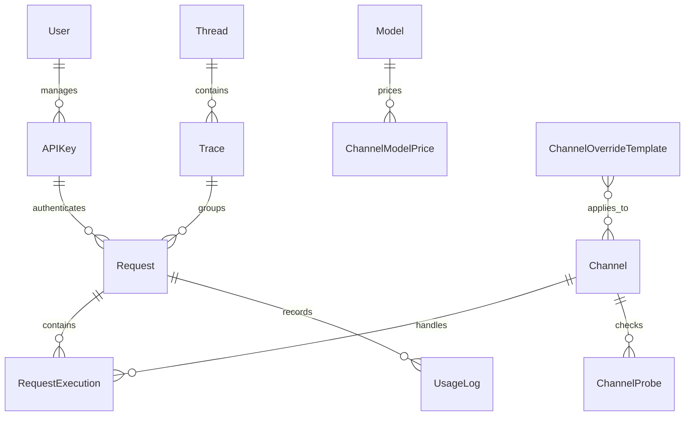

# Entity Relationship Overview

AxonHub Lite uses a single-admin, global-resource data model. There are no projects, teams, roles, OIDC identities, prompt rules, or external data-storage entities.

## Core Relationships

## Entities

| Entity | Purpose |
|--------|---------|
| User | The single administrator account used for initialization, login, profile, and password management. |
| APIKey | Global gateway keys used to call OpenAI/Anthropic-compatible endpoints. |
| Channel | Provider connection and routing configuration. |
| Model | Global model metadata, associations, and pricing. |
| Request | Global request record. |
| RequestExecution | Per-channel execution record for a request. |
| UsageLog | Token and cost accounting for requests. |
| Trace | Global trace grouping for request diagnostics. |
| Thread | Global conversation thread grouping. |
| System | Instance-level settings, including retry, storage policy, model behavior, and branding. |

## Authorization Model

The admin JWT can manage all backend resources. A valid API key can call gateway endpoints and write the associated request, trace, thread, execution, and usage records.
