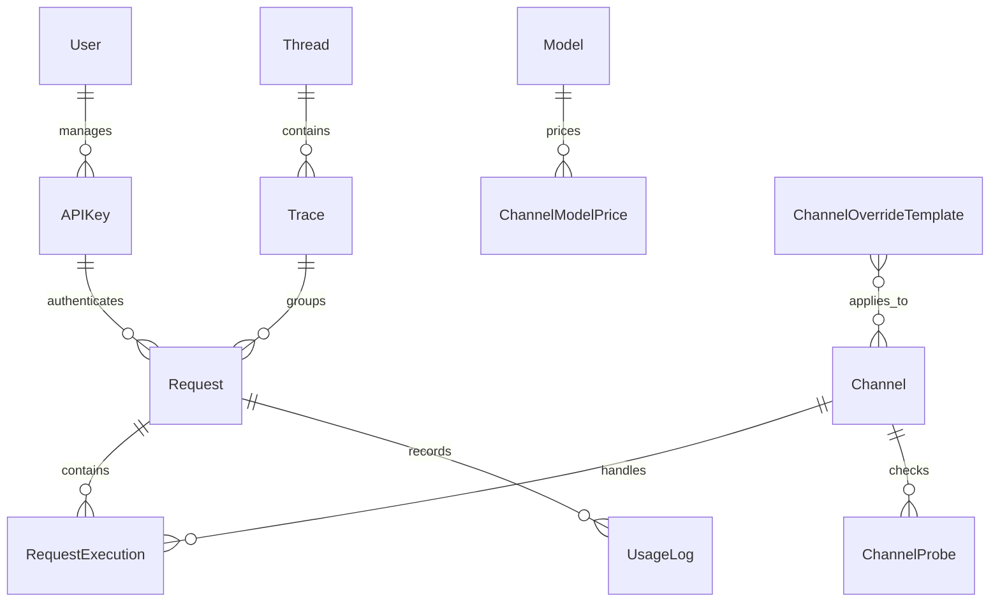

# 实体关系概览

AxonHub Lite 使用单管理员、全局资源的数据模型。系统不再包含项目、团队、角色、OIDC 身份、提示词规则或外部数据存储实体。

## 核心关系

## 实体

| 实体 | 用途 |
|------|------|
| User | 唯一管理员账号，用于初始化、登录、个人资料和密码管理。 |
| APIKey | 全局网关密钥，用于调用 OpenAI/Anthropic 兼容接口。 |
| Channel | Provider 连接和路由配置。 |
| Model | 全局模型元数据、关联和价格。 |
| Request | 全局请求记录。 |
| RequestExecution | 单次请求在某个渠道上的执行记录。 |
| UsageLog | 请求的 Token 和费用统计。 |
| Trace | 全局请求诊断链路分组。 |
| Thread | 全局会话线程分组。 |
| System | 实例级设置，包括重试、存储策略、模型行为和品牌配置。 |

## 鉴权模型

管理员 JWT 可以管理全部后台资源。有效 API Key 可以调用网关端点，并写入对应的请求、Trace、Thread、执行和用量记录。
